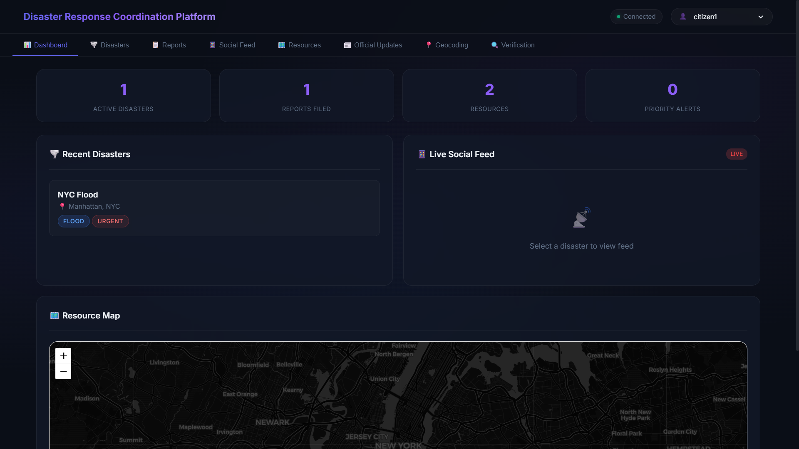
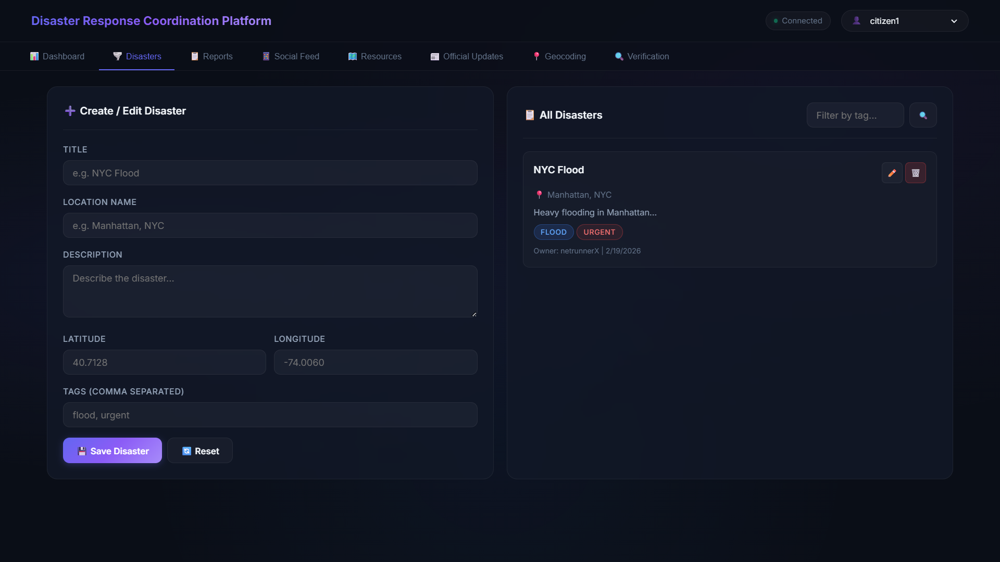
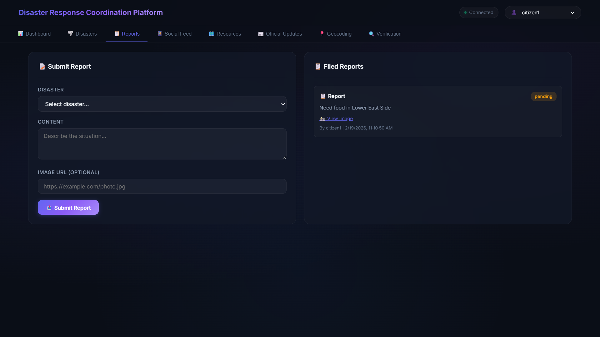
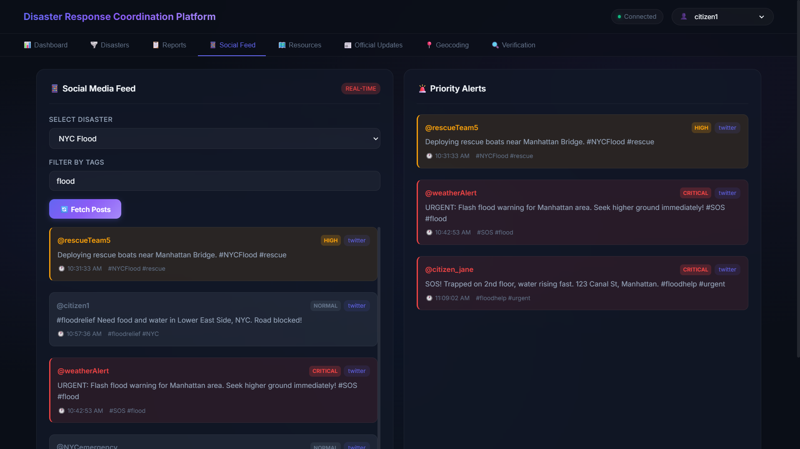
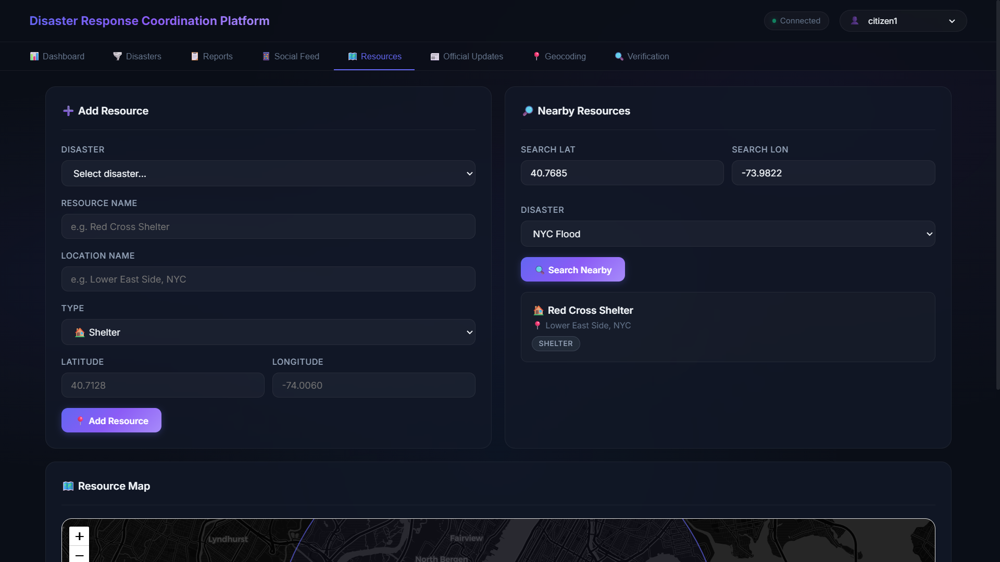
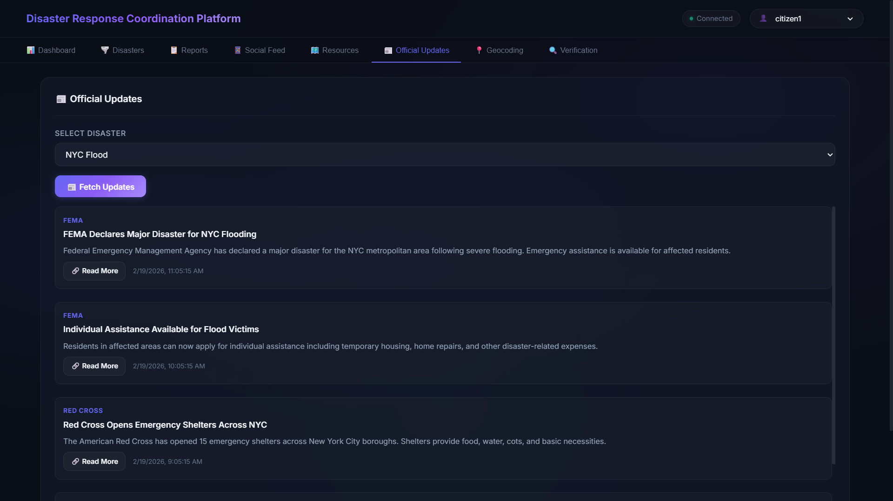
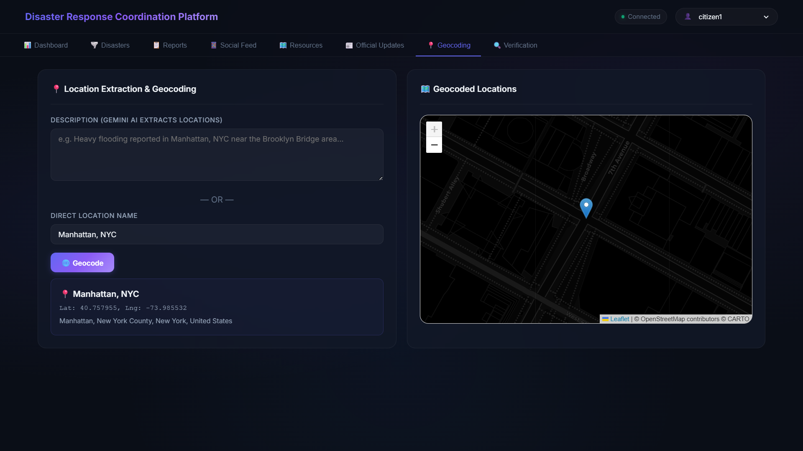
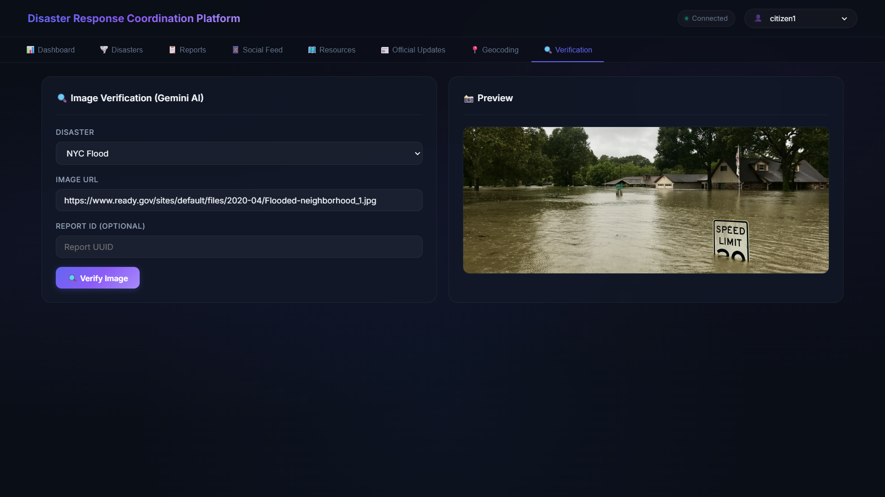

# Disaster Response Coordination Platform

A backend-heavy MERN stack application for disaster response coordination. Features real-time data aggregation, geospatial resource mapping, AI-powered location extraction and image verification, and live social media monitoring.

## Tech Stack

- **Backend:** Node.js, Express.js, Socket.IO
- **Database:** Supabase (PostgreSQL + PostGIS)
- **AI:** Google Gemini API (location extraction + image verification)
- **Geocoding:** OpenStreetMap Nominatim
- **Frontend:** Vanilla HTML/CSS/JS, Leaflet.js (interactive maps)
- **Scraping:** Cheerio (official updates from FEMA/Red Cross)

## Setup

### 1. Supabase Setup

1. Create a free project at [supabase.com](https://supabase.com)
2. Go to SQL Editor and run the contents of `supabase-schema.sql`
3. Copy your project URL and anon key from Settings → API

### 2. Environment Variables

Edit `server/.env`:
```
SUPABASE_URL=your_supabase_project_url
SUPABASE_ANON_KEY=your_supabase_anon_key
GEMINI_API_KEY=your_gemini_api_key
PORT=5000
```

### 3. Install & Run

```bash
cd server
npm install
npm run dev
```

Open [http://localhost:5000](http://localhost:5000)

## API Endpoints

| Method | Endpoint | Description |
|--------|----------|-------------|
| POST | `/api/disasters` | Create disaster |
| GET | `/api/disasters?tag=flood` | List disasters |
| PUT | `/api/disasters/:id` | Update disaster |
| DELETE | `/api/disasters/:id` | Delete disaster |
| POST | `/api/geocode` | Extract location + geocode |
| GET | `/api/disasters/:id/social-media` | Social media posts |
| GET | `/api/disasters/:id/resources?lat=&lon=` | Nearby resources |
| GET | `/api/disasters/:id/official-updates` | Official updates |
| POST | `/api/disasters/:id/verify-image` | Image verification |
| POST | `/api/reports` | Submit report |
| POST | `/api/resources` | Add resource |
| GET | `/api/mock-social-media` | Mock social media |

## WebSocket Events

- `disaster_updated` — On create/update/delete
- `social_media_updated` — On new social media fetch
- `resources_updated` — On geospatial data update

## Features

- ✅ Full CRUD for disasters with audit trails
- ✅ Gemini AI location extraction from natural language
- ✅ Gemini AI image verification for disaster photos
- ✅ Geospatial queries (PostGIS ST_DWithin)
- ✅ Mock Twitter/Bluesky social media feed
- ✅ Priority alert system (keyword-based)
- ✅ Official updates scraping (FEMA, Red Cross)
- ✅ Supabase caching with TTL
- ✅ WebSocket real-time updates
- ✅ Rate limiting & error handling
- ✅ Interactive Leaflet.js maps
- ✅ Dark-themed, modern UI

## Sample Data

```json
{
  "title": "NYC Flood",
  "location_name": "Manhattan, NYC",
  "description": "Heavy flooding in Manhattan",
  "tags": ["flood", "urgent"],
  "owner_id": "netrunnerX"
}
```

## User Interface
- 📊 Dashboard
  
  
  
- 🌪️ Disasters

  
  
- 📋 Reports

  
  
- 📱 Social Feed

  
  
- 🗺️ Resources

  
  
- 📰 Official Updates

  
  
- 📍 Geocoding
  
  
  
- 🔍 Verification
  
  
  
## License

MIT License - See LICENSE file for details
